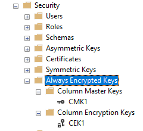
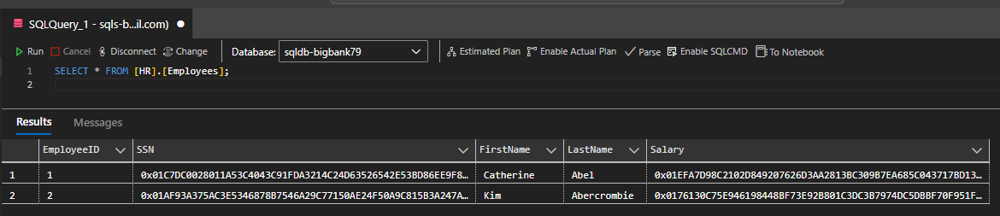

# Azure SQL Security

Implementation of advanced SQL Server security features following [best practices][1].

Set up the parameters:

```sh
cp config/sample.tfvars .auto.tfvars
```

Create the baseline infrastructure:

```sh
terraform init
terraform apply -auto-approve
```

Following sections will expand on this infrastructure for hands-on practice.

## Transparent Data Encryption (TDE)

TDE is enabled on all new databases.

This sample database is configured with CMK, and for for this purpose enabling purge protection for the Key Vault is required.

## Always Encrypted

Column-Level Security via column encryption.

Secure enclaves [supported][2] are:

- VBS (Virtual) 👈 We'll use this one.
- SGX (Hardware)

Activate the "Always Encrypted" functionality:

```sh
az sql db update -g rg-bigbank79 -s sqls-bigbank79 -n sqldb-bigbank79 --preferred-enclave-type VBS
```

> For details on next steps check the official [documentation][3] tutorial.

Using **SSMS**, connect to the database with Always Encrypted **disabled**.

Create some data running the following files:

1. [`tsql/schema.sql`](sql/schema.sql)
2. [`tsql/data.sql`](sql/data.sql)

Now create the Always Encrypted keys:

1. CMK1 (Column master key)
2. CEK1 (Column encryption key)



The Key Vaults keys should already be available for selection.

Reconnect to the database with Always Encrypted **enabled** (with Secure Enclaves, but no attestation).

Encrypt the `SSN` and `Salary` columns:

- [`tsql/encrypt.sql`](tsql/encrypt.sql)

Within the enabled session, it is possible to run [`rich queries`](tsql/richqueries.sql)

Now, connect to a new session with Always Encrypt **disabled**.

Querying results from a disabled session will now show encrypted values:



## Row-Level Security

[Row-Level Security][4] is a feature within SQL Server, but has a different mechanism than Column-Level Encryption.

## Entra ID integration

This database will be integrated with Entra ID.

## Auditing

Documentation for [audit action groups & actions][5].

Default audit groups:

```
BATCH_COMPLETED_GROUP
SUCCESSFUL_DATABASE_AUTHENTICATION_GROUP
FAILED_DATABASE_AUTHENTICATION_GROUP
```

## Ledger

Ledger is an option to verify data integrity.

This is not path for AZ-500 but will keep it here for reference.


[1]: https://learn.microsoft.com/en-us/sql/relational-databases/security/sql-server-security-best-practices?view=sql-server-ver16
[2]: https://learn.microsoft.com/en-us/sql/relational-databases/security/encryption/always-encrypted-enclaves?view=sql-server-ver16#supported-enclave-technologies
[3]: https://learn.microsoft.com/en-us/azure/azure-sql/database/always-encrypted-enclaves-getting-started-vbs?view=azuresql&tabs=ssmsrequirements%2Cazure-cli
[4]: https://learn.microsoft.com/en-us/sql/relational-databases/security/row-level-security?view=sql-server-ver16
[5]: https://learn.microsoft.com/en-us/sql/relational-databases/security/auditing/sql-server-audit-action-groups-and-actions?view=sql-server-ver16
