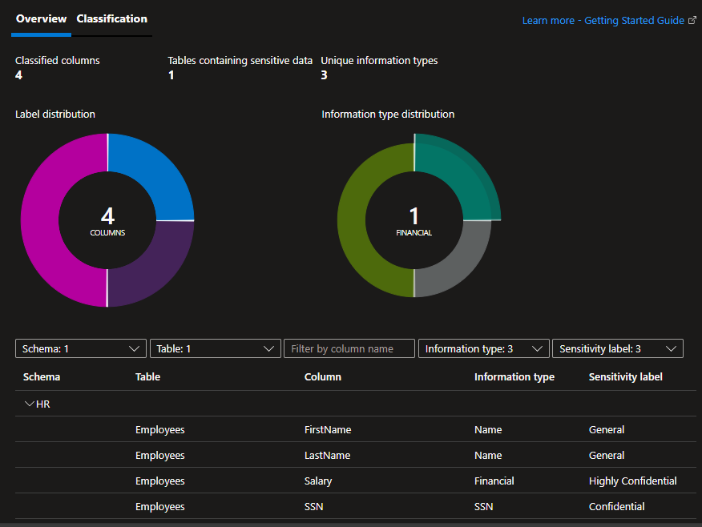

# Azure SQL Security

Implementation of advanced SQL Server security features following [best practices][1].

Set up the parameters:

> Edit the template and add your IP address

```sh
cp config/sample.tfvars .auto.tfvars
```

Create the baseline infrastructure:

```sh
terraform init
terraform apply -auto-approve
```

Following sections will expand on this infrastructure for hands-on practice.

## Transparent Data Encryption (TDE)

TDE is enabled on all new databases for Encryption-at-rest.

This sample database is configured with CMK, and for for this purpose enabling purge protection for the Key Vault is required.

It is important to notice that databases will default to the Server CMK, but it is possible to use a database-specific CMK.

## Always Encrypted

Column-Level Security via column encryption.

Secure enclaves [supported][2] are:

- VBS (Virtual) 👈 We'll use this one.
- SGX (Hardware)

Activate the "Always Encrypted" functionality:

```sh
az sql db update -g rg-bigbank79 -s sqls-bigbank79 -n sqldb-bigbank79 --preferred-enclave-type VBS
```

> For details on next steps check the official [documentation][3] tutorial.

Using **SSMS**, connect to the database with Always Encrypted **disabled**.

Create some data running the following files:

1. [`tsql/schema.sql`](sql/schema.sql)
2. [`tsql/data.sql`](sql/data.sql)

Now create the Always Encrypted keys:

> Database Engine is [not involved][7] since the data has to be protected, so T-SQL cannot be used.

1. CMK1 (Column master key)
2. CEK1 (Column encryption key)


The Key Vaults keys should already be available for selection.

Reconnect to the database with Always Encrypted **enabled** (with Secure Enclaves, but no attestation).

Encrypt the `SSN` and `Salary` columns:

- [`tsql/encrypt.sql`](tsql/encrypt.sql)

Within the enabled session, it is possible to run [`rich queries`](tsql/richqueries.sql)

Now, connect to a new session with Always Encrypt **disabled**.

Querying results from a disabled session will now show encrypted values:


## Always Encrypted with T-SQL

Here is a different [example][8] using T-SQL.

```sql
USE database;
GO

CREATE MASTER KEY ENCRYPTION BY PASSWORD = 'P@ssw0rd.123';

CREATE CERTIFICATE Certificate_key WITH SUBJECT = 'Protected my data';
```

## Row-Level Security

[Row-Level Security][4] is a feature within SQL Server, but has a different mechanism than Column-Level Encryption.

## Entra ID integration

This database will be integrated with Entra ID. The logged user will be the Entra ID Administrator.

> 💡 For Azure SQL Databases, mapping the Entra ID user to the Server is not supported, only directly to the database. But it is supported for Azure SQL Managed Instances.
>
> "Contained" database users are standalone only for the databases, but can reference External Providers such as Entra ID.

Terraform will have created an additional user `sqldeveloper` on Entra ID to use in this example.

For Azure SQL Databases, we'll create a contained database user that is mapped to an Entra ID-based login:

```sql
--Create the contained DB User authenticated by AAD
CREATE USER [sqldeveloper@<TENANT>.onmicrosoft.com] FROM EXTERNAL PROVIDER;

--Add some permissions to the user
ALTER ROLE "db_owner" ADD MEMBER "sqldeveloper@<TENANT>.onmicrosoft.com";
```

Connect with the Entra ID user specifying the database.

## Auditing

Documentation for [audit action groups & actions][5].

Default audit settings:

> The default auditing settings include the following set of action groups, which will audit all the queries and stored procedures executed against the database, as well as successful and failed logins:
> 
> 
> - BATCH_COMPLETED_GROUP
> - SUCCESSFUL_DATABASE_AUTHENTICATION_GROUP
> - FAILED_DATABASE_AUTHENTICATION_GROUP

## Ledger

Ledger is an option to verify data integrity.

This is not path for AZ-500 but will keep it here for reference.

## Data Classification

The database will be created using `SQL Information Protection` policy.

> It is possible to use `Microsoft Information Protection` to fetch sensitivity labels defined in Microsoft 365.

After creating the schema, classify the data:

```sh
az sql db classification update -g rg-bigbank79 -s sqls-bigbank79 -n sqldb-bigbank79 --column FirstName --schema HR --table Employees --information-type Name --label General
az sql db classification update -g rg-bigbank79 -s sqls-bigbank79 -n sqldb-bigbank79 --column LastName --schema HR --table Employees --information-type Name --label General
az sql db classification update -g rg-bigbank79 -s sqls-bigbank79 -n sqldb-bigbank79 --column SSN --schema HR --table Employees --information-type SSN --label Confidential
az sql db classification update -g rg-bigbank79 -s sqls-bigbank79 -n sqldb-bigbank79 --column Salary --schema HR --table Employees --information-type Financial --label "Highly Confidential"
```



## Dynamic Data Masking

Dynamic Data Masking can be applied from within or outside the database.

Check the [documentation][6] for details.

## Elastic Pools

To create an Elastic Pool, set:

```terraform
mssql_create_elastic_pool = true
```

Add the database to the elastic pool using the portal. The SKU of the database will be set as `ElasticPool`.

To enable `Always Encrypted` for the elastic pool, do it so manually.


[1]: https://learn.microsoft.com/en-us/sql/relational-databases/security/sql-server-security-best-practices?view=sql-server-ver16
[2]: https://learn.microsoft.com/en-us/sql/relational-databases/security/encryption/always-encrypted-enclaves?view=sql-server-ver16#supported-enclave-technologies
[3]: https://learn.microsoft.com/en-us/azure/azure-sql/database/always-encrypted-enclaves-getting-started-vbs?view=azuresql&tabs=ssmsrequirements%2Cazure-cli
[4]: https://learn.microsoft.com/en-us/sql/relational-databases/security/row-level-security?view=sql-server-ver16
[5]: https://learn.microsoft.com/en-us/sql/relational-databases/security/auditing/sql-server-audit-action-groups-and-actions?view=sql-server-ver16
[6]: https://learn.microsoft.com/en-us/sql/relational-databases/security/dynamic-data-masking?view=sql-server-ver16
[7]: https://learn.microsoft.com/en-us/sql/relational-databases/security/encryption/always-encrypted-database-engine?view=sql-server-ver15
[8]: https://www.sqlshack.com/an-overview-of-the-column-level-sql-server-encryption/?_ga=2.188209896.1510144942.1703251968-967359652.1700361706
